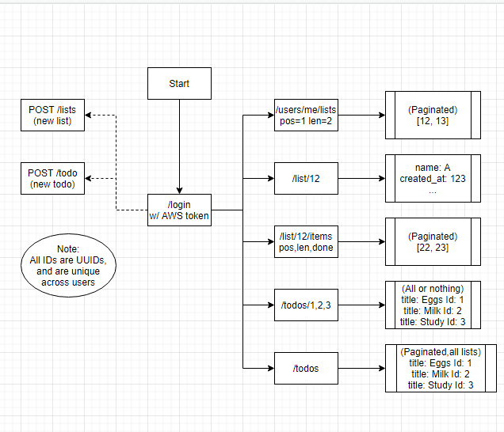

`gotodo` is a toy Todo List service written in Go, using [Fiber](https://docs.gofiber.io/) Framework, providing a RESTful API.

Here is a draft plan of how the API would work:

| key | value |
|------|-----|
| /users/12 | list_chunk: 123, token:X |
| /list_chunk/123 | lists: [1,2,3], next: None |
| /list/1 | name: X todo_chunk: 234, done_todo_chunk: 456|
| /todo_chunk/234 | todos: [5,6], next: None |
| /todo_chunk/456 | todos: [9], next: None |
| /todo/5 | title: Eggs done: False |
| /todo/9 | title: Milk done: True |
